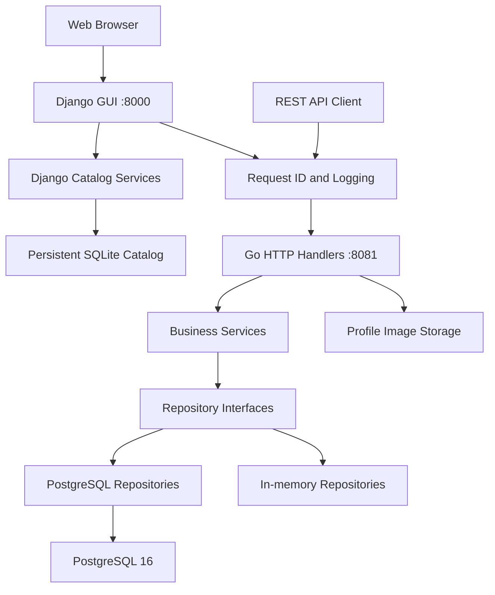
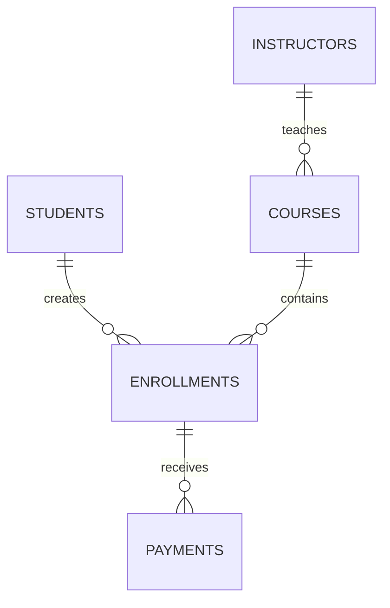

# Student Enrollment System

A production-oriented student enrollment platform consisting of a Go REST API and a professional Django web interface for managing students, instructors, courses, enrollments, profile images, payments, and educational catalog data.

The backend is implemented in Go using layered architecture, PostgreSQL persistence, automated SQL migrations, structured logging, validation, and concurrency-safe repositories. The Django GUI provides a responsive Persian dashboard, searchable course and instructor pages, a synchronized Sematec course catalog, and production deployment through Gunicorn and WhiteNoise.

## Project Information

- **Student:** Anita Bakhshi
- **Instructor:** Parham Darvishi
- **Language:** Go 1.22
- **Database:** PostgreSQL 16
- **API Port:** `8081`
- **GUI Framework:** Django 5.2
- **GUI Port:** `8000`

## Features

### Student Management

- Create, list, retrieve, update, and soft-delete students
- Validate student information
- Prevent duplicate national codes and email addresses
- Upload and serve secure profile images
- Preserve uploaded files in a Docker volume

### Instructor Management

- Complete instructor CRUD operations
- Validate instructor status and contact information
- Prevent duplicate instructor email addresses
- Soft-delete instructor records

### Course Management

- Complete course CRUD operations
- Assign courses to instructors
- Validate course dates, capacity, duration, price, and status
- Prevent duplicate course codes
- Reject inactive or missing instructors

### Enrollment Management

- Enroll students in courses
- List enrollments globally, by student, or by course
- Prevent duplicate active enrollments
- Enforce course capacity
- Protect capacity checks against concurrent requests
- Support enrollment lifecycle transitions:

```text
pending → confirmed → completed
       ↘ cancelled
```

### Payment Management

- Create payments for enrollments
- Obtain the authoritative payment amount from the course price
- Prevent clients from manually changing the payment amount
- Prevent multiple active payments for one enrollment
- Prevent duplicate transaction IDs
- Support failed payment retries
- Automatically confirm pending enrollments after successful payment
- Support the following payment lifecycle:

```text
pending → succeeded → refunded
       ↘ failed
```

### Django Web Interface

- Professional RTL Persian dashboard
- Responsive desktop and mobile design
- Live connection to the Go REST API
- Student, instructor, course, enrollment, and payment statistics
- Searchable and filterable course catalog
- Instructor directory and profile pages
- Individual course detail pages
- Unicode-compatible Persian and English URLs
- Graceful handling of temporary Go API failures
- Production execution with Gunicorn
- Static-file delivery through WhiteNoise

### Educational Catalog

- Advanced Django models for categories, instructors, courses, and offerings
- Repeatable seed command for initial catalog data
- Synchronization command for verified Sematec catalog information
- 53 instructor profiles
- 118 course records
- 77 active instructor-course offerings
- Course filtering by category and instructor
- Instructor and course search
- Persistent SQLite catalog database in a Docker volume

### Infrastructure

- PostgreSQL persistence using `pgx`
- Sequential SQL migrations
- Docker multi-stage build
- Docker Compose orchestration
- PostgreSQL health checks
- Persistent database and upload volumes
- Adminer database interface
- Structured JSON logs
- Request ID middleware
- Non-root API container
- Separate non-root Django GUI container
- Gunicorn production WSGI server
- WhiteNoise compressed static files
- Persistent Django catalog volume
- Docker health check for the GUI
- Automatic Django migrations and catalog seeding
- Optional one-time Sematec catalog synchronization
- Unit, integration, concurrency, and race-detector tests

## Technology Stack

| Component | Technology |
|---|---|
| Backend language | Go 1.22 |
| Backend HTTP server | Go `net/http` |
| GUI language | Python 3.12 |
| GUI framework | Django 5.2 |
| Production WSGI server | Gunicorn |
| Static-file serving | WhiteNoise |
| API database | PostgreSQL 16 |
| Catalog database | SQLite |
| PostgreSQL driver | `pgx/v5` |
| Catalog synchronization | Requests and Beautiful Soup |
| Containers | Docker |
| Orchestration | Docker Compose |
| Database UI | Adminer |
| Go testing | `testing`, `httptest`, Race Detector |
| Django testing | Django TestCase |
| Logging | Go `log/slog` and Gunicorn logs |

## Architecture

The application combines a layered Go backend with a server-rendered Django GUI:



### Layers

- **Handler:** HTTP parsing, response generation, and status codes
- **Service:** validation and business rules
- **Repository:** persistence abstraction and domain errors
- **Model:** application entities and request structures
- **Database:** PostgreSQL connection pool
- **Storage:** secure local profile-image storage
- **Middleware:** structured request logging and request IDs
- **Django Dashboard:** server-rendered RTL management interface
- **Catalog Models:** course, category, instructor, and offering persistence
- **API Client:** communication between Django and the Go REST API
- **Catalog Synchronizer:** repeatable synchronization of verified educational data
- **Gunicorn:** production WSGI process manager
- **WhiteNoise:** compressed static-file delivery

## Database Relationships



## Project Structure

```text
.
├── cmd/
│   └── api/
│       └── main.go
├── internal/
│   ├── config/
│   ├── database/
│   ├── handler/
│   ├── middleware/
│   ├── model/
│   ├── repository/
│   ├── service/
│   └── storage/
├── django_frontend/
│   ├── catalog/
│   │   ├── management/
│   │   │   └── commands/
│   │   │       ├── seed_catalog.py
│   │   │       └── sync_sematec_catalog.py
│   │   ├── migrations/
│   │   ├── models.py
│   │   ├── views.py
│   │   └── urls.py
│   ├── dashboard/
│   │   ├── api_client.py
│   │   ├── views.py
│   │   └── tests.py
│   ├── config/
│   ├── static/
│   ├── templates/
│   ├── .dockerignore
│   ├── Dockerfile
│   ├── docker-entrypoint.sh
│   ├── manage.py
│   └── requirements.txt
├── migrations/
│   ├── 000001_create_students.up.sql
│   ├── 000001_create_students.down.sql
│   ├── 000002_create_instructors_courses.up.sql
│   ├── 000002_create_instructors_courses.down.sql
│   ├── 000003_create_enrollments.up.sql
│   ├── 000003_create_enrollments.down.sql
│   ├── 000004_create_payments.up.sql
│   └── 000004_create_payments.down.sql
├── scripts/
│   ├── build.sh
│   ├── dev.sh
│   ├── logs.sh
│   ├── migrate-up.sh
│   ├── migrate-down.sh
│   ├── start.sh
│   ├── stop.sh
│   └── test.sh
├── .env.example
├── .dockerignore
├── .gitignore
├── Dockerfile
├── docker-compose.yml
├── go.mod
└── go.sum
```

## Requirements

For the Docker-based setup:

- Docker Engine
- Docker Compose

For local development:

- Go 1.22 or newer
- Python 3.10 or newer
- Docker and Docker Compose for PostgreSQL

## Quick Start with Docker

### 1. Clone the repository

```bash
git clone https://github.com/anita-bakhshi/student-enrollment-system.git
cd student-enrollment-system
```

### 2. Create the environment file

```bash
cp .env.example .env
```

Change passwords and configuration values when using the project outside a local development environment.

### 3. Start the application

```bash
./scripts/start.sh
```

Alternatively:

```bash
docker compose up -d --build
```

The startup process automatically:

1. Starts PostgreSQL and applies pending Go API migrations
2. Starts the Go REST API on port `8081`
3. Applies Django migrations
4. Loads the initial catalog and optionally synchronizes Sematec data once
5. Collects static files through WhiteNoise
6. Starts the Django GUI through Gunicorn on port `8000`

### 4. Check the containers

```bash
docker compose ps -a
```

### 5. Check API and GUI health

```bash
curl -i http://localhost:8081/health
curl -I http://localhost:8000/
curl -I http://localhost:8000/courses/
curl -I http://localhost:8000/instructors/
```

Expected status:

```text
HTTP/1.1 200 OK
```

### Available Services

| Service | Address |
|---|---|
| Django GUI | http://localhost:8000 |
| Course catalog | http://localhost:8000/courses/ |
| Instructor directory | http://localhost:8000/instructors/ |
| REST API | http://localhost:8081 |
| Health endpoint | http://localhost:8081/health |
| Adminer | http://localhost:18080 |
| PostgreSQL host port | `5433` |

### Adminer Connection

Use these values with the default development configuration:

| Field | Value |
|---|---|
| System | PostgreSQL |
| Server | `postgres` |
| Username | `student_app` |
| Password | Value of `POSTGRES_PASSWORD` |
| Database | `student_enrollment` |

## Local Development

Copy the environment configuration:

```bash
cp .env.example .env
```

Start PostgreSQL and run the API locally:

```bash
./scripts/dev.sh
```

This command:

1. Stops the containerized API
2. Starts PostgreSQL and Adminer
3. Applies pending migrations
4. Loads variables from `.env`
5. Executes `go run ./cmd/api`

In a second terminal, create and activate the Django virtual environment:

```bash
python3 -m venv django_frontend/.venv
source django_frontend/.venv/bin/activate
python -m pip install -r django_frontend/requirements.txt
```

Apply Django migrations, seed the catalog, and start the development server:

```bash
python django_frontend/manage.py migrate
python django_frontend/manage.py seed_catalog
python django_frontend/manage.py runserver 0.0.0.0:8000
```

To synchronize the verified Sematec catalog manually:

```bash
python django_frontend/manage.py sync_sematec_catalog --delay 0.2
```

## Environment Variables

| Variable | Default | Description |
|---|---|---|
| `APP_ENV` | `development` | Application environment |
| `APP_PORT` | `8081` | HTTP server port |
| `HTTP_READ_TIMEOUT` | `10s` | HTTP read timeout |
| `HTTP_WRITE_TIMEOUT` | `10s` | HTTP write timeout |
| `HTTP_IDLE_TIMEOUT` | `60s` | HTTP idle timeout |
| `POSTGRES_DB` | `student_enrollment` | PostgreSQL database |
| `POSTGRES_USER` | `student_app` | PostgreSQL user |
| `POSTGRES_PASSWORD` | `student_secret` | Development password |
| `POSTGRES_HOST_PORT` | `5433` | PostgreSQL host port |
| `DATABASE_URL` | PostgreSQL URL | API database connection string |
| `UPLOAD_DIR` | `./uploads` | Profile-image storage directory |
| `DJANGO_SECRET_KEY` | No production default | Django cryptographic secret |
| `DJANGO_DEBUG` | `false` in Docker | Enable Django debug mode |
| `DJANGO_ALLOWED_HOSTS` | Local Docker hosts | Permitted Django host names |
| `DJANGO_DB_PATH` | `/app/data/db.sqlite3` in Docker | Persistent catalog database path |
| `GO_API_BASE_URL` | `http://api:8081` in Docker | Go API address used by Django |
| `GO_API_TIMEOUT` | `10` | Django-to-Go API timeout in seconds |
| `DJANGO_SYNC_SEMATEC_ON_START` | `true` | Run the initial Sematec synchronization |
| `SEMATEC_SYNC_DELAY` | `0.2` | Delay between catalog requests |

Do not commit the local `.env` file. It is excluded through `.gitignore`.

## API Response Format

Successful responses use this structure:

```json
{
  "success": true,
  "message": "Operation completed successfully",
  "data": {}
}
```

Validation errors use this structure:

```json
{
  "success": false,
  "message": "Validation failed",
  "errors": {
    "field": "Validation message"
  }
}
```

## API Endpoints

### Health

| Method | Endpoint | Description |
|---|---|---|
| GET | `/health` | Check API health |

### Students

| Method | Endpoint | Description |
|---|---|---|
| GET | `/api/v1/students` | List students |
| GET | `/api/v1/students/{id}` | Get one student |
| POST | `/api/v1/students` | Create a student |
| PUT | `/api/v1/students/{id}` | Update a student |
| DELETE | `/api/v1/students/{id}` | Soft-delete a student |
| POST | `/api/v1/students/{id}/photo` | Upload profile image |
| GET | `/uploads/{filename}` | Retrieve uploaded image |
| GET | `/api/v1/students/{id}/enrollments` | List student enrollments |

### Instructors

| Method | Endpoint | Description |
|---|---|---|
| GET | `/api/v1/instructors` | List instructors |
| GET | `/api/v1/instructors/{id}` | Get one instructor |
| POST | `/api/v1/instructors` | Create an instructor |
| PUT | `/api/v1/instructors/{id}` | Update an instructor |
| DELETE | `/api/v1/instructors/{id}` | Soft-delete an instructor |

### Courses

| Method | Endpoint | Description |
|---|---|---|
| GET | `/api/v1/courses` | List courses |
| GET | `/api/v1/courses/{id}` | Get one course |
| POST | `/api/v1/courses` | Create a course |
| PUT | `/api/v1/courses/{id}` | Update a course |
| DELETE | `/api/v1/courses/{id}` | Soft-delete a course |
| GET | `/api/v1/courses/{id}/enrollments` | List course enrollments |

### Enrollments

| Method | Endpoint | Description |
|---|---|---|
| GET | `/api/v1/enrollments` | List enrollments |
| GET | `/api/v1/enrollments/{id}` | Get enrollment details |
| POST | `/api/v1/enrollments` | Enroll a student |
| PUT | `/api/v1/enrollments/{id}` | Change enrollment status |
| DELETE | `/api/v1/enrollments/{id}` | Soft-delete an enrollment |
| GET | `/api/v1/enrollments/{id}/payments` | List enrollment payments |

### Payments

| Method | Endpoint | Description |
|---|---|---|
| GET | `/api/v1/payments` | List payments |
| GET | `/api/v1/payments/{id}` | Get complete payment details |
| POST | `/api/v1/payments` | Create a pending payment |
| PUT | `/api/v1/payments/{id}` | Change payment status |
| DELETE | `/api/v1/payments/{id}` | Delete pending or failed payment |

## API Examples

### Create a Student

```bash
curl -i -X POST \
  http://localhost:8081/api/v1/students \
  -H "Content-Type: application/json" \
  -d '{
    "first_name": "Sara",
    "last_name": "Mohammadi",
    "age": 21,
    "national_code": "1234567890",
    "email": "sara@example.com",
    "phone": "09123456789"
  }'
```

### Upload a Student Profile Image

```bash
curl -i -X POST \
  http://localhost:8081/api/v1/students/1/photo \
  -F "photo=@/path/to/profile.png"
```

### Create an Enrollment

```bash
curl -i -X POST \
  http://localhost:8081/api/v1/enrollments \
  -H "Content-Type: application/json" \
  -d '{
    "student_id": 1,
    "course_id": 1,
    "notes": "Online registration"
  }'
```

### Confirm an Enrollment

```bash
curl -i -X PUT \
  http://localhost:8081/api/v1/enrollments/1 \
  -H "Content-Type: application/json" \
  -d '{
    "status": "confirmed",
    "notes": "Enrollment confirmed"
  }'
```

### Create a Payment

The amount and currency are obtained from the course and cannot be supplied by the client.

```bash
curl -i -X POST \
  http://localhost:8081/api/v1/payments \
  -H "Content-Type: application/json" \
  -d '{
    "enrollment_id": 1,
    "payment_method": "online",
    "description": "Course payment"
  }'
```

### Complete a Payment

```bash
curl -i -X PUT \
  http://localhost:8081/api/v1/payments/1 \
  -H "Content-Type: application/json" \
  -d '{
    "status": "succeeded",
    "transaction_id": "txn-20260919-001",
    "gateway_reference": "gateway-ref-001",
    "card_last_four": "1234",
    "description": "Payment verified"
  }'
```

## Profile Image Upload Security

The image upload subsystem includes:

- File-size restrictions
- Extension validation
- Content-type validation
- Generated random filenames
- Path traversal protection
- Non-executable upload storage
- Non-root container access
- Persistent Docker volume storage

Only the generated path is stored in PostgreSQL.

## Payment Security

The Payment API intentionally does not store complete card information.

Only the following limited reference information can be stored:

- Transaction identifier
- Gateway reference
- Last four card digits
- Payment result and timestamps

The payment amount is obtained from the course price on the server and is not accepted from the client.

## Database Migrations

Apply pending migrations:

```bash
./scripts/migrate-up.sh
```

Review applied migrations:

```bash
docker exec student_enrollment_postgres \
  psql -U student_app -d student_enrollment \
  -c "SELECT version, applied_at
      FROM schema_migrations
      ORDER BY version;"
```

Rollback operations are destructive and require explicit confirmation:

```bash
CONFIRM_MIGRATION_DOWN=yes ./scripts/migrate-down.sh
```

## Testing

Run all project checks:

```bash
./scripts/test.sh
```

The test script performs:

```bash
gofmt
go vet ./...
go test -v ./...
go test -race ./...
```

Individual commands can also be executed:

```bash
go fmt ./...
go vet ./...
go test ./...
go test -race ./...
```

Run the Django checks and test suite:

```bash
source django_frontend/.venv/bin/activate
cd django_frontend
python manage.py check
python manage.py test --verbosity 2
```

The test suite covers:

- Models and validation
- Memory repositories
- Service business rules
- HTTP handlers
- Integration routes
- Duplicate protection
- Course capacity
- Concurrent enrollment and payment operations
- Profile-image upload validation
- Payment lifecycle transitions
- Race detection
- Dashboard API integration and failure handling
- Course and instructor catalog views
- Search and filtering behavior
- Catalog seed idempotency
- Sematec synchronization and dry-run rollback

## Project Scripts

| Script | Description |
|---|---|
| `./scripts/start.sh` | Build and start the complete application |
| `./scripts/stop.sh` | Stop containers and preserve volumes |
| `./scripts/dev.sh` | Run PostgreSQL in Docker and API locally |
| `./scripts/build.sh` | Build the Docker API image |
| `./scripts/test.sh` | Run formatting, vet, tests, and Race Detector |
| `./scripts/logs.sh api` | Follow API logs |
| `./scripts/logs.sh gui` | Follow Django and Gunicorn logs |
| `./scripts/logs.sh postgres` | Follow PostgreSQL logs |
| `./scripts/logs.sh migrate` | Follow migration logs |
| `./scripts/logs.sh adminer` | Follow Adminer logs |
| `./scripts/migrate-up.sh` | Apply pending migrations |
| `./scripts/migrate-down.sh` | Roll back the database after confirmation |

## Useful Commands

Start services:

```bash
docker compose up -d
```

View status:

```bash
docker compose ps -a
```

Follow API logs:

```bash
./scripts/logs.sh api
```

Follow Django GUI logs:

```bash
./scripts/logs.sh gui
```

Open the main interfaces:

```bash
explorer.exe "http://localhost:8000"
explorer.exe "http://localhost:8000/courses/"
explorer.exe "http://localhost:8000/instructors/"
explorer.exe "http://localhost:18080"
```

Stop services while preserving data:

```bash
./scripts/stop.sh
```

Stop services and remove volumes:

```bash
docker compose down -v
```

> Warning: removing volumes permanently deletes PostgreSQL records, uploaded images, and the Django catalog database.

## HTTP Status Codes

| Code | Meaning |
|---|---|
| `200 OK` | Successful retrieval or update |
| `201 Created` | Resource created |
| `204 No Content` | Resource deleted |
| `400 Bad Request` | Invalid JSON, ID, or validation |
| `404 Not Found` | Resource does not exist |
| `409 Conflict` | Duplicate or capacity conflict |
| `415 Unsupported Media Type` | Invalid image type |
| `500 Internal Server Error` | Unexpected server error |

## Logging and Request IDs

Every HTTP request is logged with information such as:

- Request ID
- HTTP method
- Request path
- Response status
- Response size
- Duration
- Remote address

A custom request ID can be supplied:

```bash
curl -i \
  http://localhost:8081/health \
  -H "X-Request-ID: anita-test-001"
```

The same request ID is returned in the response headers and included in structured logs.

## Data Persistence

Docker Compose uses three named volumes:

- `student_enrollment_postgres_data`
- `student_enrollment_uploads`
- `student_enrollment_django_data`

The Django volume stores the SQLite catalog database and the one-time Sematec synchronization marker. This preserves the 53 instructors, 118 courses, and 77 active offerings between container restarts and rebuilds.

Running the following command preserves data:

```bash
docker compose down
```

Running this command removes persistent data:

```bash
docker compose down -v
```

## Current Version

```text
v1.1.0
```

## Author

**Anita Bakhshi**

Student Enrollment System — implemented with Go, Django, PostgreSQL, SQLite, Docker Compose, layered architecture, automated migrations, secure uploads, enrollment capacity control, payment lifecycle management, and a synchronized educational catalog.
